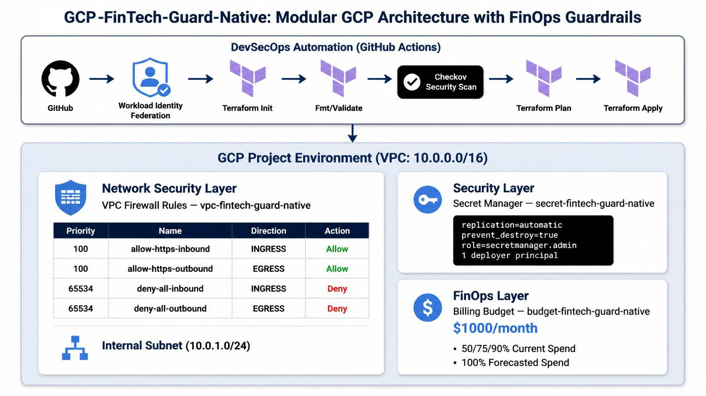
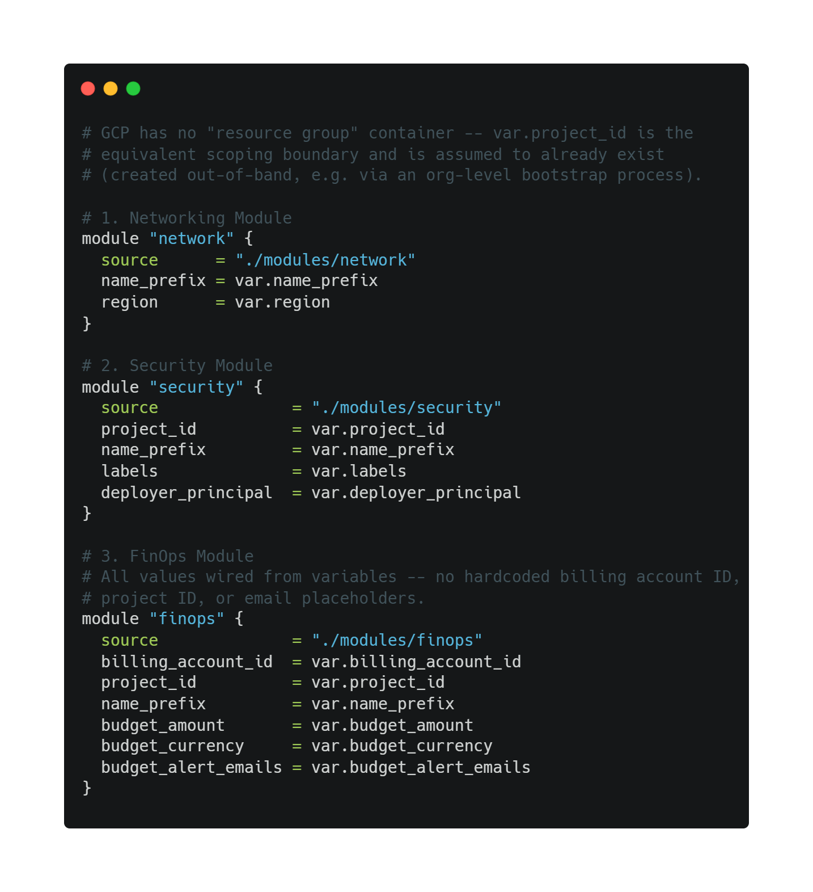
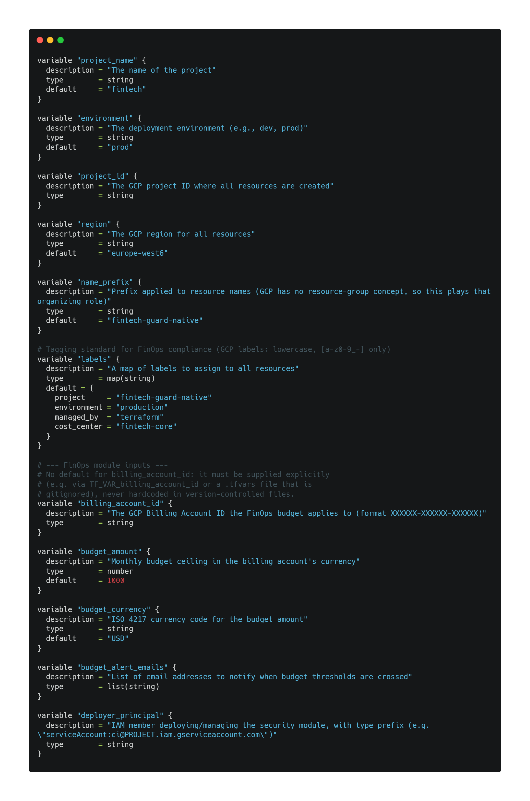
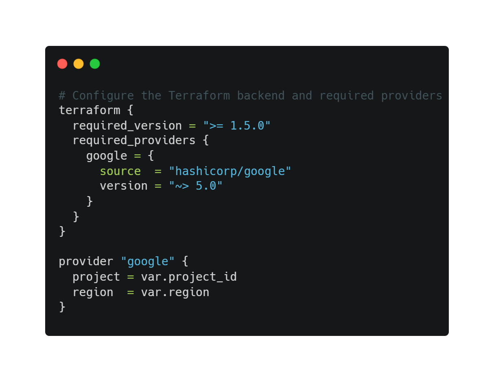
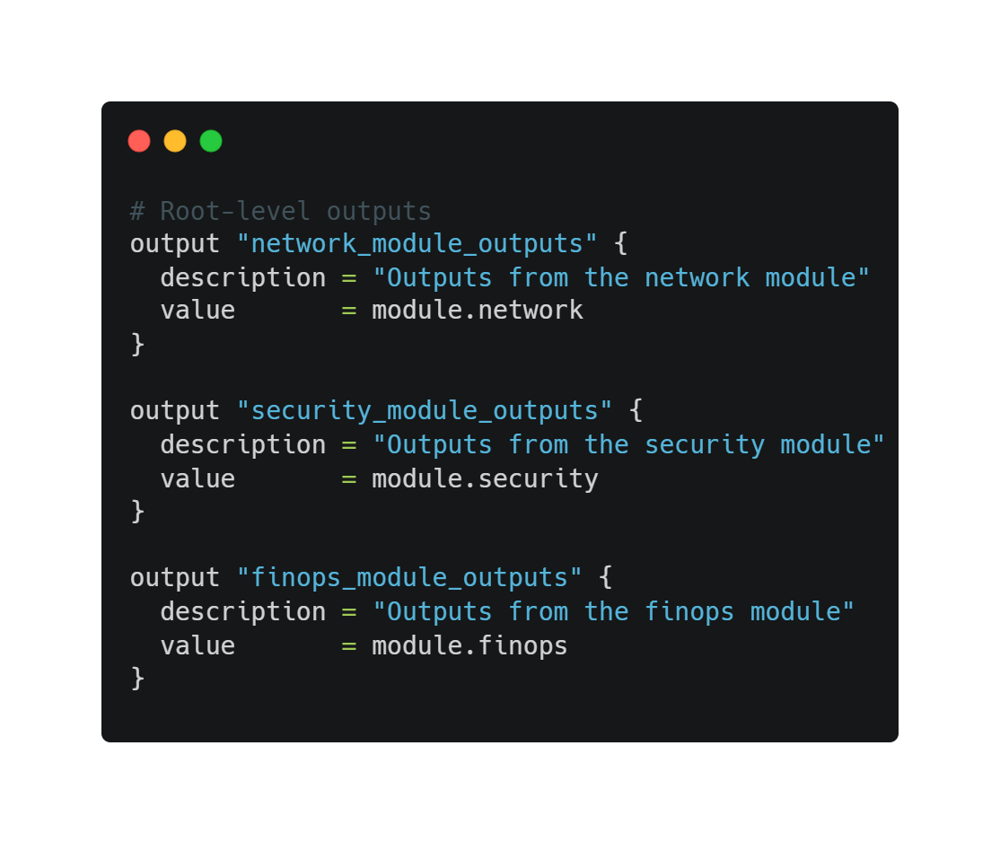
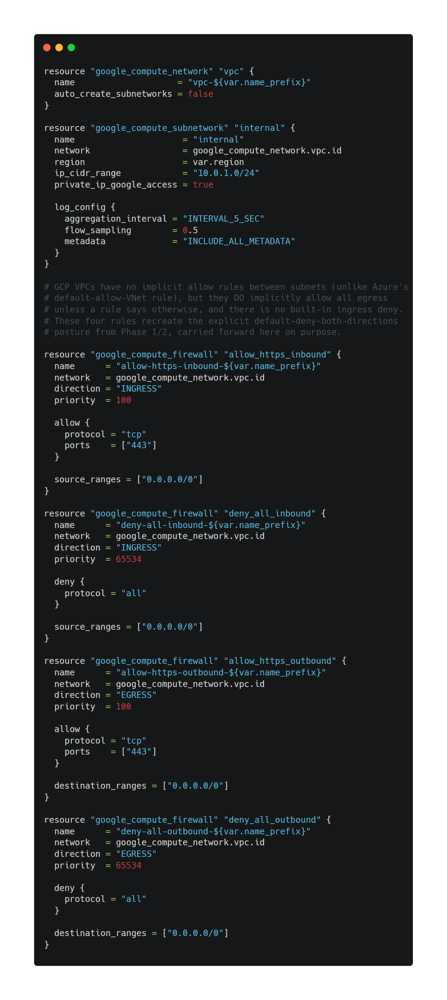
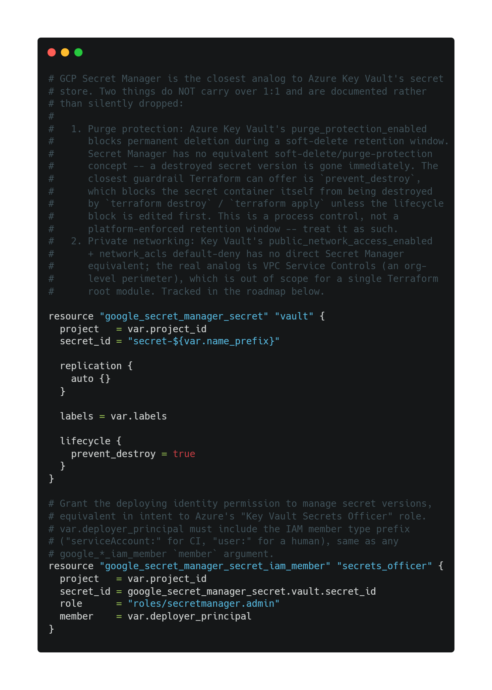
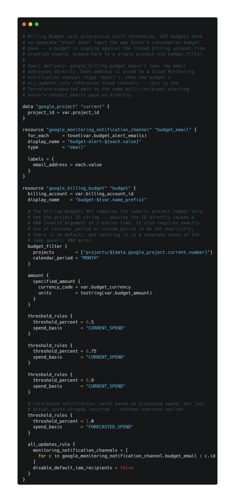

# FinTech-Guard-Native: Architettura Cloud Modulare con Guardrail FinOps

**Leggilo in:** [English](README.md) | [Español](README.es.md) | [Italiano](README.it.md)

## 🎯 Panoramica
**FinTech-Guard-Native** reimplementa la stessa base di sicurezza e FinOps del progetto gemello su un altro cloud principale, ristrutturata in moduli Terraform riutilizzabili con un guardrail FinOps, pensato per la pressione di costi e conformità tipica di un carico di lavoro nel settore dei servizi finanziari.

## 🏗️ Diagramma dell'Architettura

## 💡 Cosa Aggiunge Questo Progetto
* **Architettura modulare:** `/modules/network`, `/modules/security`, `/modules/finops` invece di file `.tf` piatti nella root — ogni ambito è revisionabile e riutilizzabile in modo indipendente, cosa che conta sempre di più man mano che il codice cresce tra i team.
* **FinOps come codice:** un Billing Budget con quattro soglie di notifica progressive (50%, 75%, 90% di spesa effettiva, più un avviso al 100% *previsto*), invece di un unico avviso tardivo.
* **La stessa base irrobustita, mantenuta:** regole firewall esplicite di deny-by-default in entrambe le direzioni, un secret di Secret Manager con IAM ristretto, e un guardrail lifecycle `prevent_destroy` al posto della finestra di soft-delete/purge-protection del progetto originale.

## 🛡️ Cosa È Effettivamente Implementato
* **Firewall VPC, entrambe le direzioni:** regole esplicite di allow per HTTPS (443) in entrata e uscita, con un deny-all di chiusura su ciascuna direzione, applicate a livello di VPC (GCP non ha un passaggio di associazione NSG-subnet — le regole firewall si collegano direttamente alla rete).
* **Secret Manager, irrobustito:** `roles/secretmanager.admin` limitato a un singolo principal deployer nominato (nessuna concessione ampia a livello di progetto), replica automatica, e `lifecycle { prevent_destroy = true }` sul contenitore del secret.
* **Budget FinOps, progressivo:** quattro notifiche invece di una — tre soglie di spesa effettiva (50/75/90%) e una di spesa prevista (100%), consegnate tramite canali di notifica email di Cloud Monitoring per indirizzo, tutto collegato tramite variabili Terraform anziché valori hardcoded.
* **Nessun segreto o ID hardcoded:** `billing_account_id`, `deployer_principal` e `budget_alert_emails` sono variabili obbligatorie senza valore predefinito, fornite tramite variabili d'ambiente `TF_VAR_*` in CI o un `terraform.tfvars` locale escluso da Git. Vedi `terraform.tfvars.example`.

## ⚠️ Dove Questo Differisce Realmente Dal Progetto Originale
Due guardrail non hanno un equivalente diretto su questa piattaforma, e vengono segnalati qui invece di essere riprodotti silenziosamente:

1. **Protezione dall'eliminazione.** La purge-protection del Key Vault del progetto originale offre una finestra di retention soft-delete che sopravvive anche a una chiamata di eliminazione. Secret Manager non ha un equivalente: una versione di secret distrutta scompare immediatamente. `prevent_destroy` in questo modulo è un controllo di processo a livello Terraform (blocca `terraform destroy`/`apply` dal rimuovere la risorsa a meno che il blocco lifecycle non venga modificato prima) — non è una finestra di recupero imposta dalla piattaforma. Non trattarlo come tale.
2. **Isolamento di rete privato.** Il `public_network_access_enabled = false` + le ACL di rete deny-by-default del progetto originale limitano il piano dati del Key Vault a reti fidate. L'equivalente più vicino in GCP è un perimetro VPC Service Controls a livello di organizzazione, fuori dallo scope di un modulo root Terraform a livello di progetto. Tracciato più sotto come voce della roadmap, come lo era sulla piattaforma originale.

## 🔍 Scomposizione dei Componenti
### Root
**`main.tf`** — orchestra i tre moduli sottostanti (nessun contenitore equivalente a un resource group da creare; si assume che `var.project_id` esista già).

**`variables.tf`** — input a livello di progetto, inclusi i parametri FinOps (nessun valore predefinito per l'ID di fatturazione, il principal deployer, o le email di alert, per design).

**`providers.tf`** — configurazione di Terraform e del provider `google`.

**`outputs.tf`** — aggrega gli output di ciascun modulo.

### `modules/network`
VPC, subnet, e quattro regole firewall (allow HTTPS + deny-all, entrambe le direzioni).

### `modules/security`
Secret di Secret Manager con replica automatica, binding IAM ristretto, e un guardrail lifecycle `prevent_destroy`.

### `modules/finops`
Il billing budget con soglie progressive e canali di notifica email per destinatario, parametrizzato per ID di fatturazione, ID progetto, importo/valuta del budget, ed email di alert.

---

## 🛠️ Stack Tecnologico
* **Cloud:** Google Cloud Platform (VPC, Secret Manager, Cloud Billing Budgets, canali di notifica Cloud Monitoring)
* **IaC:** HashiCorp Terraform (provider `google` ~> 5.0), struttura modulare
* **Scansione di Sicurezza:** Checkov (bloccante, `soft_fail: false`)
* **CI/CD:** GitHub Actions con Workload Identity Federation (nessuna chiave di service account a lunga durata)
* **Controllo Versione:** Git (GitHub)

## 🤖 Pipeline CI/CD
La pipeline esegue, in ordine: login Workload Identity Federation → `terraform init` → `terraform fmt -check -recursive` → `terraform validate` → scansione di sicurezza Checkov (bloccante) → `terraform plan` → `terraform apply` (solo su `main`).

Secret richiesti nel repo GitHub: `GCP_WORKLOAD_IDENTITY_PROVIDER`, `GCP_SERVICE_ACCOUNT`, `GCP_PROJECT_ID`, `GCP_BILLING_ACCOUNT_ID`, `BUDGET_ALERT_EMAILS`, `GCP_BUDGET_CURRENCY`.

## 📈 Roadmap
* **Org Policy:** monitoraggio continuo della conformità, in parallelo con la voce Azure Policy del progetto originale.
* **VPC Service Controls:** un vero perimetro di rete attorno al secret di Secret Manager, chiudendo il gap segnalato sopra.
* **Backend remoto:** un bucket GCS con state locking (ancora in sospeso, stesso gap della voce di backend remoto del progetto originale).

## 🚀 Guida al Deployment
1. Copia `terraform.tfvars.example` in `terraform.tfvars` e fornisci il tuo ID progetto GCP, ID account di fatturazione, principal deployer, ed email di alert del budget.
2. `terraform init`
3. `terraform validate` / `terraform plan` — consigliato prima di qualsiasi apply, per rivedere le modifiche esatte.
4. `terraform apply` — in questo repo, questo passaggio viene eseguito automaticamente tramite la pipeline CI/CD ad ogni push su `main` (vedi sopra). Per deployment manuali/locali fuori dalla CI, eseguilo direttamente contro il tuo state.
5. `terraform destroy` al termine, per evitare costi indesiderati. Nota: questo progetto non usa ancora un backend di state remoto (vedi roadmap), quindi lo state è locale all'ambiente in cui è stato eseguito l'apply — mantieni le esecuzioni locali e CI sulla stessa fonte di verità per evitare drift.

## 🤝 Contribuzione
Aperto a PR e discussioni di architettura da chiunque lavori su sicurezza cloud o FinOps.